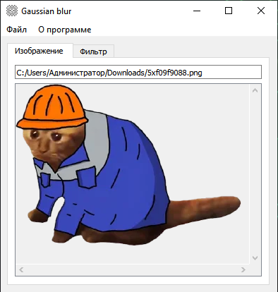
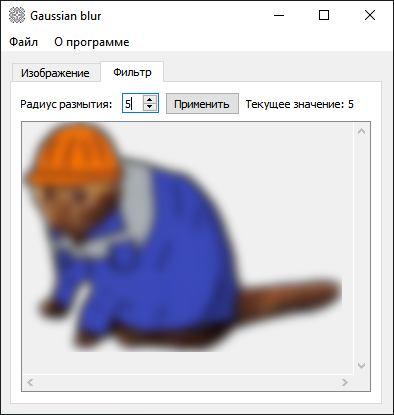

# Фильтр для размытия изображений по Гауссу

## Описание

Программа выполняет размытие изображений по Гауссу с указанным параметром - радиусом (от 2 до 20) и позволяет сохранить обработанное изображение. Поддерживаемые форматы: *.bmp, *.jpg, *.png. Разработана на С++ с использованием Qt и CMake.  


## Технические требования

- С++14;
- Qt 5.15;
- CMake.

## Установка

```bash
   cd GaussianBlurFilter
   mkdir build
   cd build
```  

```bash
   cmake ..
   cmake --build .
```  

## Запуск с использованием Docker

Сборка образа:
```bash
   cd GaussianBlurFilter
   docker build -t gaussian-filter . 
```

Запуск:
```bash
   docker run -it gaussian-filter
```
Запуск с графическим интерфейсом для Linux (WSL):
```bash
   xhost +local:docker
   docker run -it --rm -e DISPLAY=$DISPLAY -v /tmp/.X11-unix:/tmp/.X11-unix gaussian-filter
```
Запуск с графическим интерфейсом для Windows с использованием X-сервера (VcXsrv):
```powershell
   docker run -it --rm -e DISPLAY=host.docker.internal:0 gaussian-filter
```
